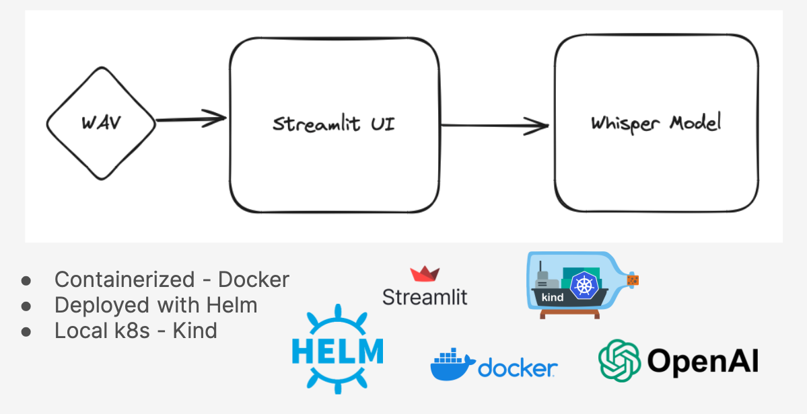

# Whisper Self-Hosted LLM with Helm and Kind
This repo is a fork of [this great project](https://github.com/redhat-et/whisper-self-hosted-llm) with self-host enhancements using:
* Containerized streamlit
* Kind as a local k8s provisioning
* Helm charts for deployment
* Start-up scripts

This repo contains artifacts that can be used to build and run the [Whisper LLM](https://github.com/openai/whisper) (Large Language Model) service locally on your laptops using containerization methods.
These containerized LLM services can be used to help developers quickly prototype new LLM based applications, without the need for relying
on any other externally hosted services.

Project design


## Requirements
* Docker installed
* Kind installed
* Helm installed

## Prepare environment
Run the following script to build the whisper and streamlit docker images, and download the Whisper model binary:
```
./build-images.sh
```

## (Mac users) prepare your mac
Run the following script to prepare your mac for running the model:
```
./mac-prerequisites.sh
```
- Remember to edit the kind-config-example.yaml with the right path to the downloaded model binary 

## Self-host Whisper!
Run the following script to provision a kind cluster and deploy 
```
./self-host-install.sh
```


## Setting up LLMs via Self-Hosting
The discussion surrounding LLMs has evolved, transitioning from "Should we utilize LLMs?" to "Should we opt for a self-hosted solution or rely on a proprietary off-the-shelf alternative?" Depending on your use-case, computational needs and engineering architecture availabilities you can decide whether to self-host your LLM.

Some benefits of self-hosting your LLM are:
* Greater security, privacy, and compliance
* Customization
* Avoid vendor lock-in
* Save computational costs
* Easy to get started for those new to or just starting their journey with LLMs

## LLM Use Cases

There are various applications for LLMs such as text generation, speech recognition and RAG applications. For the purpose of this demo, we are considering a speech recognition application:

* [Speech Recognition](#speech-recognition)

### Speech Recognition

We are using the [OpenAI's Whisper model](https://github.com/openai/whisper) for speech recognition. Whisper is a general-purpose speech recognition model. It is trained on a large dataset of diverse audio and is also a multitasking model that can perform multilingual speech recognition, speech translation, and language identification. There are five model sizes, four with English-only versions, offering speed and accuracy tradeoffs:

* tiny
* base
* small
* medium
* large

We are using the compressed `.ggml` model binaries from HuggingFace which can be found here: https://huggingface.co/ggerganov/whisper.cpp.
